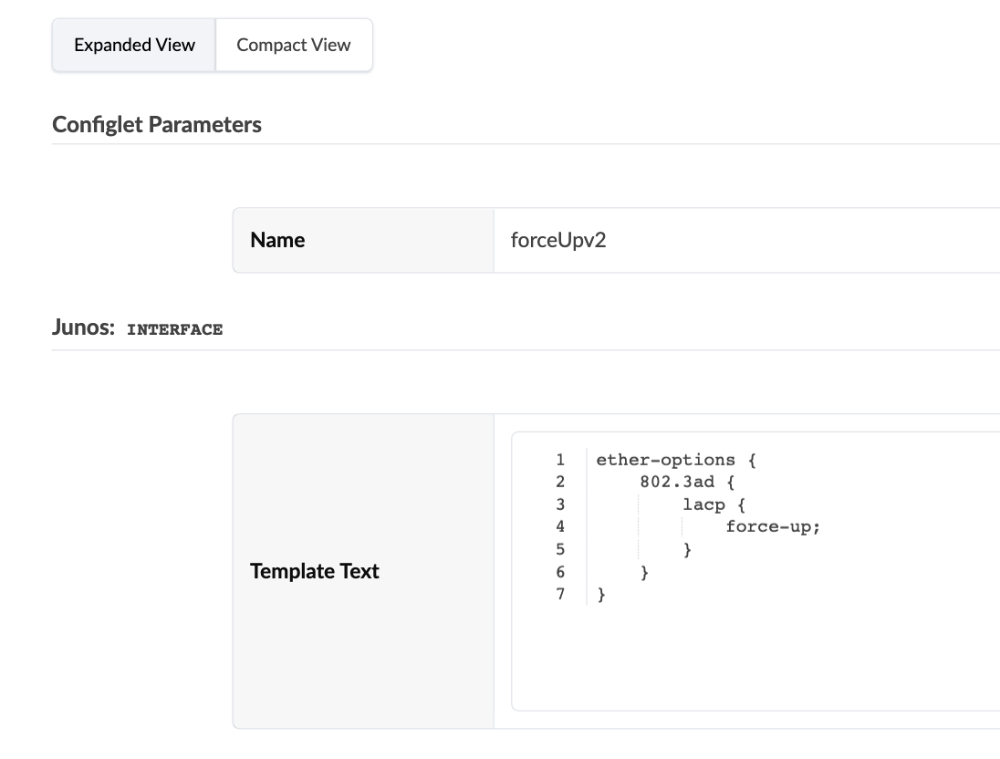
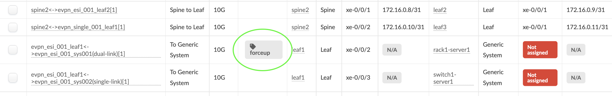
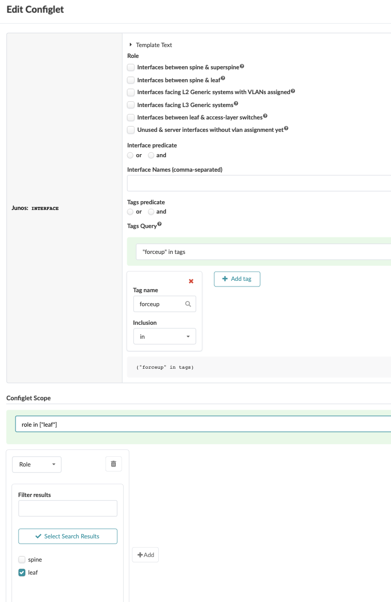

# This configlet is used to ensure the ae interface comes up regardless of whether it has seen LACP BPDUs or not
# This is a requirement for PXE boot

# First create the configlet itself

# Second: tag the interface you want to apply the config in the configlet

# Third: Import the configlet into the BP Catalogue and assign it to the interfaces where the 'forceup' tag has been assigned

