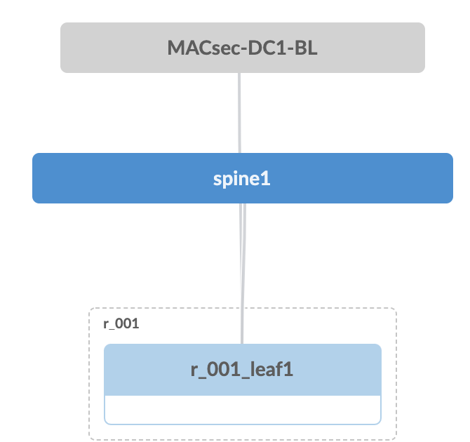
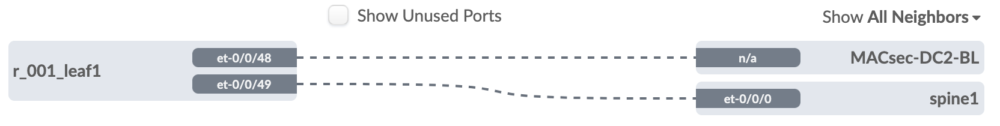
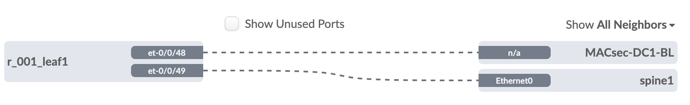
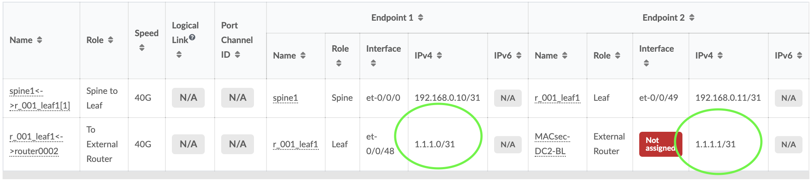
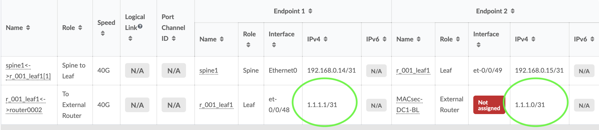
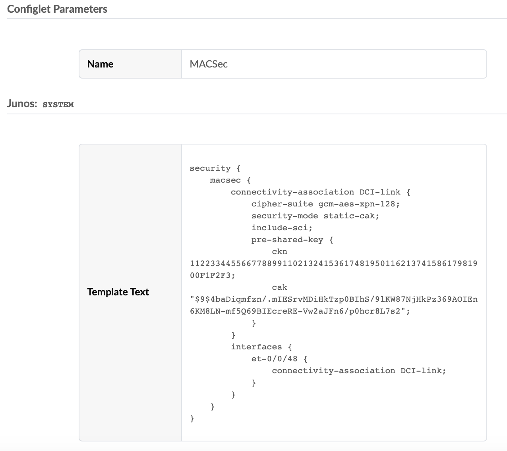

# Media Access Control Security (MACSec)
## Background

Media Access Control Security (MACsec) is an
industry-standard security technology that provides secure communication
for almost all types of traffic on Ethernet links. MACsec provides
point-to-point security on Ethernet links between directly-connected
nodes and is capable of identifying and preventing most security
threats, including denial of service, intrusion, man-in-the-middle,
masquerading, passive wiretapping, and playback attacks. MACsec is
standardized in IEEE 802.1AE.

You can configure MACsec to secure point-to-point
Ethernet links connecting switches, or on Ethernet links connecting a
switch to a host device such as a PC, phone, or server. Each
point-to-point Ethernet link that you want to secure using MACsec must
be configured independently. Two approaches to implementing
MACSec

1.  Static Secure Association Key (SAK) security mode
2. Static Connectivity Association Key (CAK)

CAK is the preferred method for switches, as described below.

[Juniper documentation ](https://www.juniper.net/documentation/en_US/junos/topics/task/configuration/macsec.html)
> [!WARNING]
We recommend enabling MACsec using static CAK security mode on
switch-to-switch links. Static CAK security mode ensures security by
frequently refreshing to a new random secure association key (SAK) and
by only sharing the SAK between the two devices on the MACsec-secured
point-to-point link. Additionally, some optional MACsec features—replay
protection, SCI tagging, and the ability to exclude traffic from
MACsec—are only available in static CAK security mode.


> [!NOTE]
A feature license is required to configure MACsec on an EX Series or a QFX Series switch, except the QFX10000-6C-DWDM and QFX10000-30C-M line cards. If the MACsec licence is not installed, MACsec functionality cannot be activated. The MACsec feature license is an independent feature license and not part of an enhanced or advanced feature license aka EFL / AFL

> [!WARNING]
> ## Known Issue: MACsec Connection Reset
> 
> There is a known issue where MACsec connections restart after every commit done via Apstra. This problem is also reproducible when performing configuration changes using the "load override" command in JunOS CLI. The core of the issue lies in the way the licence is being handled during configuration changes.
> 
> ### Symptoms
> 
> - MACsec connection resets every time after committing configuration changes via Apstra.
> - The issue is replicated when using "load override" in JunOS CLI.
> - Logs show the deletion and reinstallation of the licence during the configuration load, as demonstrated by licence event logs:
> 
> ```
> 679 Oct 14 08:45:42.658593 license_event_logger:384 message: Received license "deletion" event for feature 154
> 681 Oct 14 08:45:42.658618 license_event_handler:396 LICENSE_EVENT INSTALL/DELETE event:2
> 777 Oct 14 08:45:42.912469 license_event_logger:384 message: Received license "installation" event for feature 154
> 779 Oct 14 08:45:42.912489 license_event_handler:396 LICENSE_EVENT INSTALL/DELETE event:1
> ```
> 
> ### Temporary Workaround
> 
> While PR1841551 has been raised to address the issue from the JunOS side, a temporary workaround is available. To avoid the MACsec reset issue, change the method of licence installation:
> 
> Instead of relying on the current method of embedding the licence configuration within the general system configuration, add a licence from CLI by the following commands:
> 
> ```
> request system license add terminal
> ```

## Problem Statement

P2P DCI links at Juniper are often secured with MACSec. With AOS
v3.3.0.2, MACSec isn’t supported as part of the Intent model. This
document describes how to deploy MACSec with a configlet.

## How to re-create this test

The config used in the configlet was built by using set commands on two
QFX5120-48YM switches in a lab environment. In this lab, port et-0/0/48
on both switches, were connected together, to simulate the DCI
connection.

Two Blueprints were created which consisted of an undeployed spine and
the deployed QFX5120-48YM border leaf.

AIS Topology - View from DC2  
Device IP Details: 

| Device Name   |      IP      |    AS |
|---------------|:------------:|------:|
| MACSec-DC1-BL | 192.168.0.9  | 64521 |
| MACSec-DC2-BL | 192.168.0.13 | 64523 |


## Adding an external router

In each BP, an external router was created on et-0/0/48 and the opposite
BL added as an external router

### View from DC1



### View from DC2



## P2P link IP addressing

The interface IP addresses were manually added as 1.1.1.0/31 on both
switches as shown below

### View from DC1



### View from DC2



## Configuring MACsec Using CAK 

When you enable MACsec using static CAK security mode, a pre-shared key
is exchanged between the switches on each end of the point-to-point
Ethernet link. The pre-shared key includes a connectivity association
name (CKN) and a connectivity association key (CAK). The CKN and CAK are
configured by the user in the connectivity association and must match on
both ends of the link to initially enable MACsec.

Only when the keys are exchanged and verified will MACSec be enabled on
the link. The randomized security key enables and
maintains MACsec on the point-to-point link. The key server will
continue to periodically create and share a randomly-created security
key over the point-to-point link for as long as MACsec is
enabled.

You enable MACsec using static CAK security mode by
configuring a connectivity association on both ends of the link. All
configuration is done within the connectivity association but outside of
the secure channel. Two secure channels—one for inbound traffic and one
for outbound traffic—are automatically created when using static CAK
security mode. The automatically-created secure channels do not have any
user-configurable parameters that cannot already be configured in the
connectivity association.

## To configure MACsec using static CAK security mode

### Create a connectivity association

```junos
set security macsec connectivity-association DCI-link cipher-suite gcm-aes-xpn-128
set security macsec connectivity-association DCI-link security-mode static-cak
set security macsec connectivity-association DCI-link include-sci
set security macsec connectivity-association DCI-link pre-shared-key ckn 1122334455667788991102132415361748195011621374158617981900F1F2F3
set security macsec connectivity-association DCI-link pre-shared-key cak "12345678910121314151617181910FFF"
set security macsec interfaces et-0/0/48 connectivity-association DCI-link
```

This results in the following configuration which was copy/pasted into a
Configlet
```
security {
    macsec {
        connectivity-association DCI-link 
        cipher-suite gcm-aes-xpn-128;
        security-mode static-cak;
        include-sci;
            {
                ckn 1122334455667788991102132415361748195011621374158617981900F1F2F3;
                cak "$9$4baDiqmfzn/.mIESrvMDiHkTzp0BIhS/9lKW87NjHkPz369AOIEn6KM8LN-mf5Q69BIEcreRE-Vw2aJFn6/p0hcr8L7s2";
            }
        }
        interfaces {
            et-0/0/48 {
                connectivity-association DCI-link;
            }
        }
    }
}
```
### How to view MACSec working
```
tzieger@DC2-BL1# run show security macsec connections 
Interface name: et-0/0/48
CA name: DCI-link
Cipher suite: GCM-AES-XPN-128 Encryption: on
Key server offset: 0 Include SCI: yes
Replay protect: off Replay window: 0
Outbound secure channels
SC Id: 40:8F:9D:49:6E:B5/1
Outgoing packet number: 561
Secure associations
AN: 0 Status: inuse Create time: 01:24:05
Inbound secure channels
SC Id: 40:8F:9D:4A:04:B5/1
Secure associations
AN: 0 Status: inuse Create time: 01:24:05
```

### How the configlet looks in AIS

