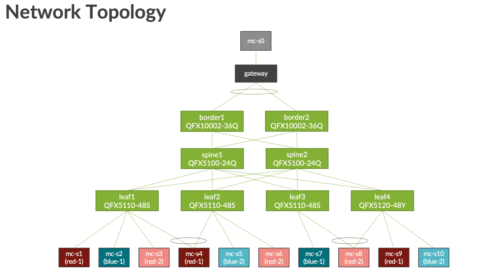

This directory of configlets can be used to deploy OISM with JUNOS and Apstra. 

### Basic setup ###
Here is an example network topology:

1. For basic configuration you will need to name the VLANs appropriately:

2. Next provision the SBD VLAN:

3. We use a property set to assign values needed for external connectivity:

4. Next create the two configlets (you can import the json here or copy and paste) Make sure you assign them to the correct devices via tags or manually via the Apstra UI.

Here is an example of the resulting generated configurations from the configlets:

### Border leaf connectivity to Multicast gateway ###
Here is an example of a pair of border leaf devices connectivity to an upstream MCAST gateway:

1. To provision the MVLAN on the border leafs follow the following steps:

2. Next, you will need a connectivity template for the multicast router to peer with the border leaf over BGP, and Assign it to the correct Aggregated interface (in this case):

3. Now update the property set with the correct IP Addresses: 

### Multicast gateway example configuration ###

Here is an example multicast router configuration:

### Inter-VRF Multicast routing ###

1. If you want inter-vrf multicast routing you will need to make a few additional changes, here is an example diagram:

2. Make the following modifications to your setup to add the additional elements, including Connectivity Template Additions:

3. Modify the property set to enable the additional VRFs. 

Here is the rendered configuration for the border leaf:

The rendered server leaf configuration:

And added changes to the Multicast gateway configuration: 

### Additional Resources ### 
Here is the [Juniper Tech publication about OISM with EVPN and VXLAN](https://www.juniper.net/documentation/us/en/software/junos/evpn-vxlan/topics/topic-map/oism-evpn-vxlan.html).