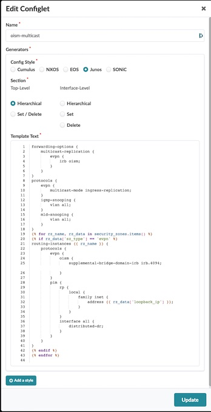
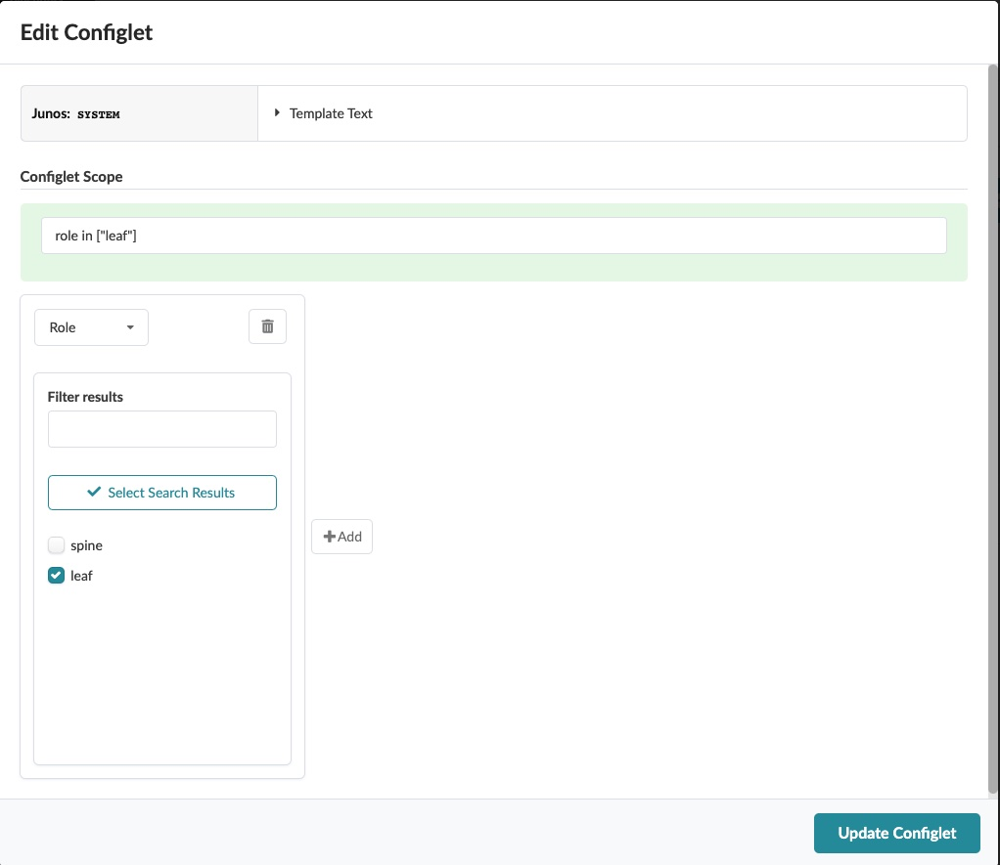

# oism-multicast
This configlet is to configure Optimized InterSubnet Multicast on ERB leafs.

# Prerequisite
- Junos release 21.2R1 or later
- Virtual Network with IRB enabled VLAN 4094 (vn4094) bound to all the leaf switches

https://www.juniper.net/documentation/us/en/software/junos/evpn-vxlan/topics/topic-map/oism-evpn-vxlan.html

# Create Configlet

# Attach Configlet

