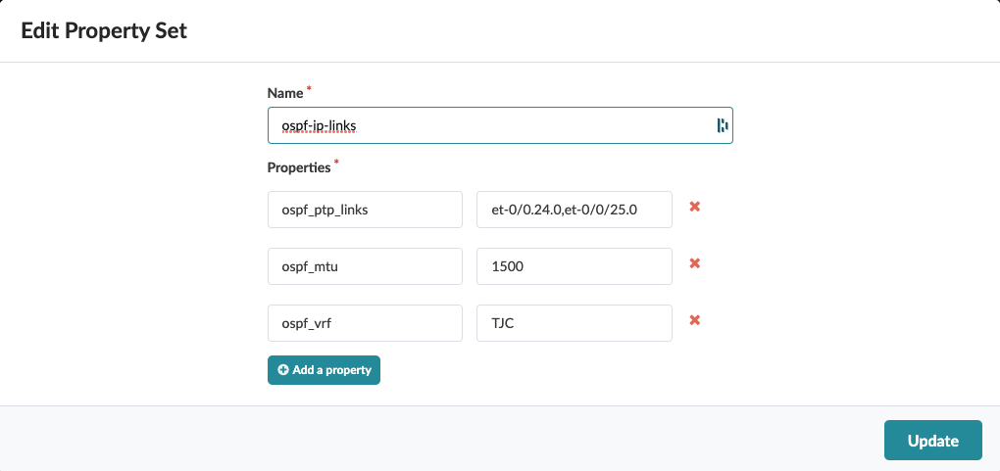
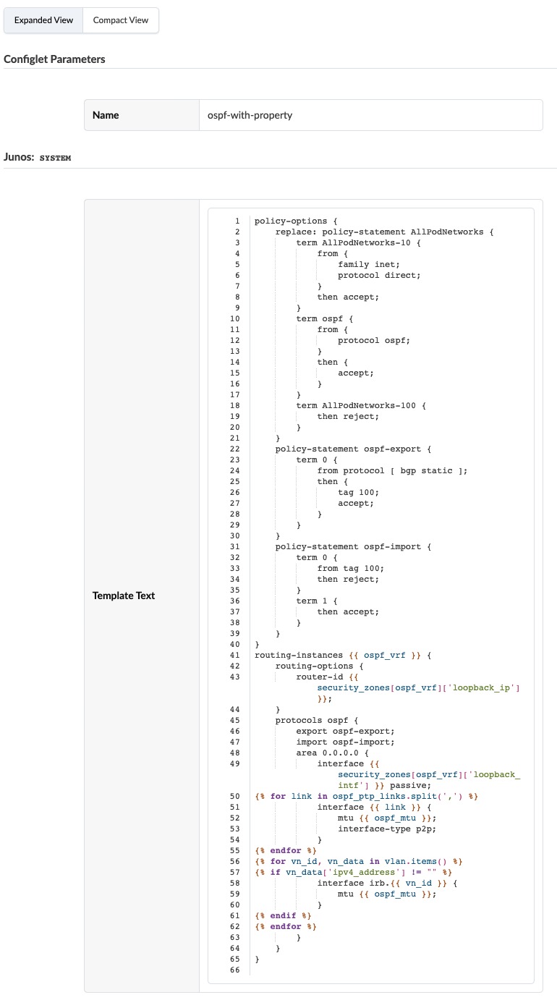
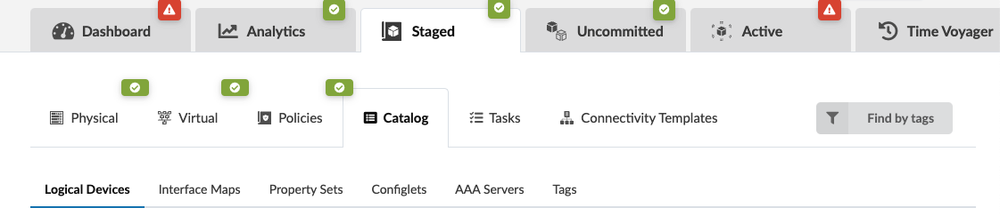
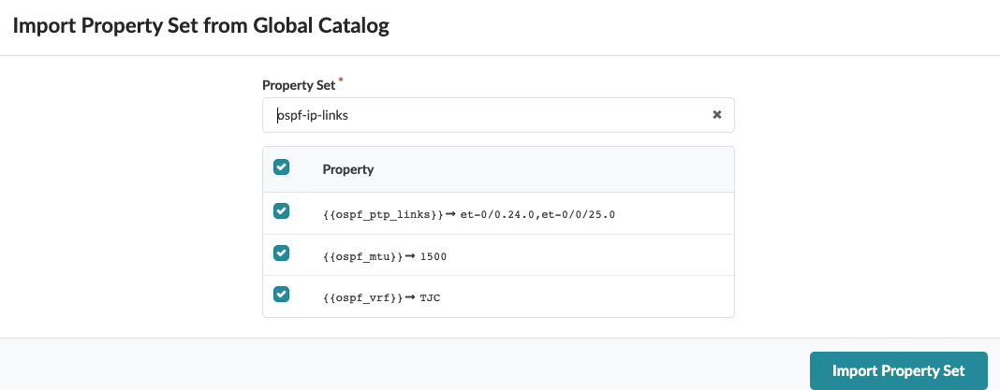
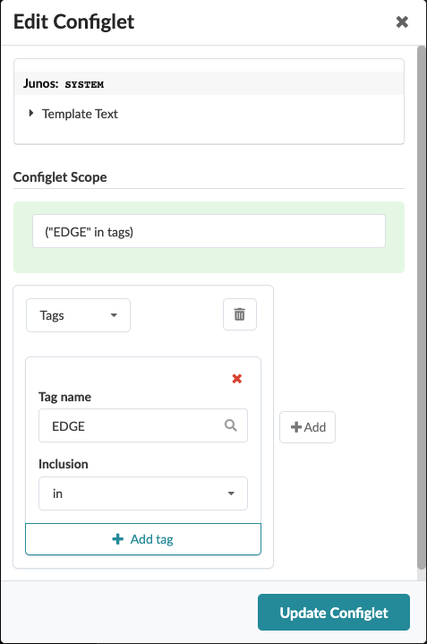

# ospf-with-property
This configlet is to configure OSPF interfaces for IRBs (when its IP was configured) and PtP interfaces.

# Create Property Set

# Create Configlet

# Import Property Set

# Import Configlet
Import configlet for the leafs. This example uses tag 'EDGE'.

