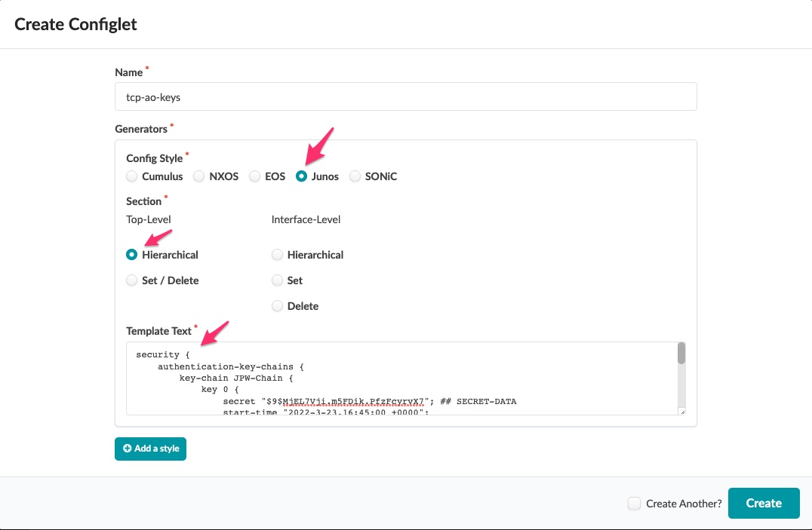
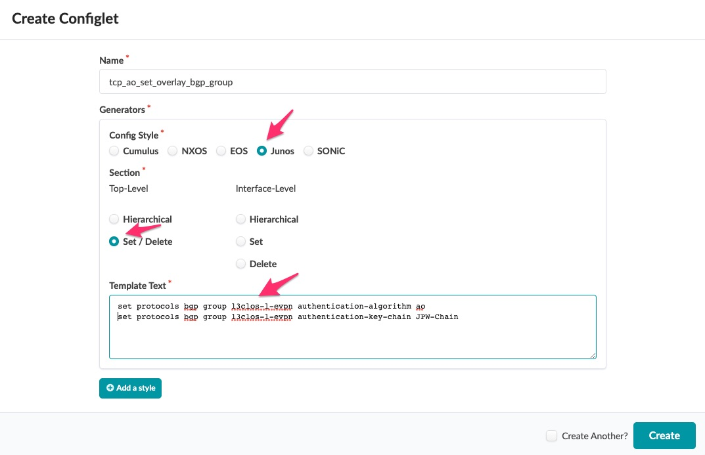
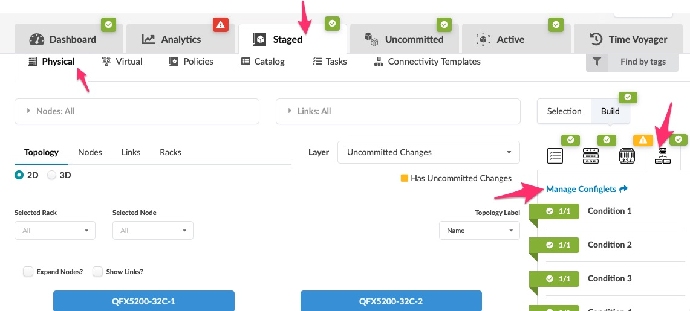
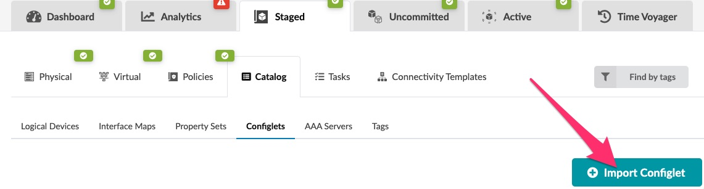
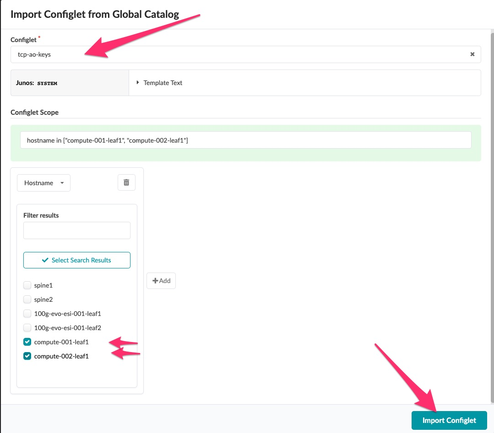
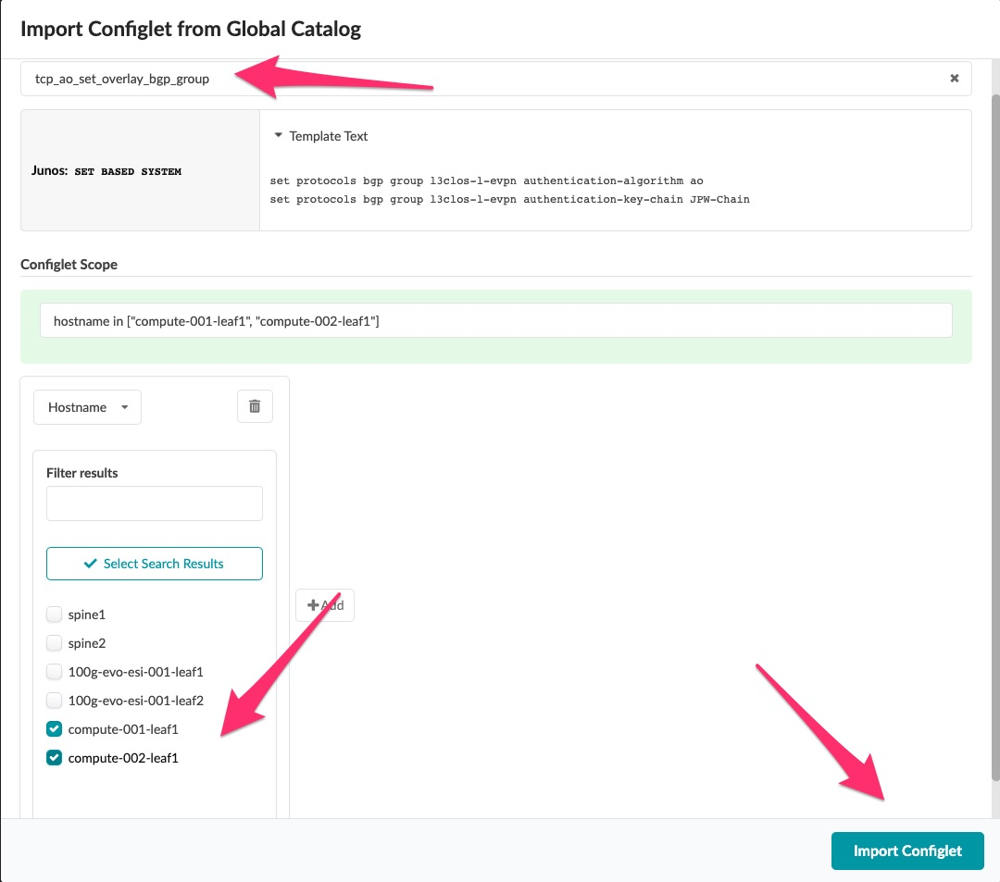
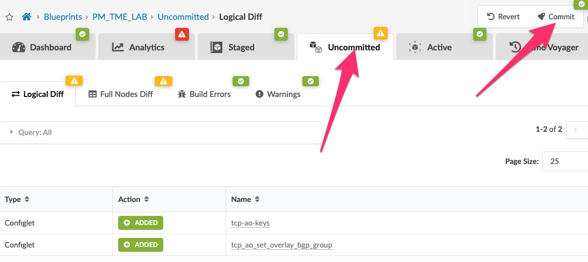

# Workflow

To deploy tcp-ao with junos devices follow the following workflow.
1. create a key or several keys.
    - the keys have a start date associated with them, which allows for key rollover.
    ```junos
    set security authentication-key-chains key-chain JPW-Chain key 1 secret juniperApstraSecret
    set security authentication-key-chains key-chain JPW-Chain key 1 start-time "2022-3-28.12:00:00 +0000"
    set security authentication-key-chains key-chain JPW-Chain key 1 algorithm ao
    set security authentication-key-chains key-chain JPW-Chain key 1 ao-attribute send-id 1
    set security authentication-key-chains key-chain JPW-Chain key 1 ao-attribute recv-id 1
    set security authentication-key-chains key-chain JPW-Chain key 1 ao-attribute tcp-ao-option enabled
    set security authentication-key-chains key-chain JPW-Chain key 1 ao-attribute cryptographic-algorithm aes-128-cmac-96

2. Export the stanza for import into a configlet in the Apstra UI.
   - Here I display the stanza from the ```show configuration ``` junos command for the security stanza, this allows me to pull the encrypted key from junos so I do not display the key in plain text.
   ``` 
   security {
      authentication-key-chains {
          key-chain JPW-Chain {
              key 0 {
                  secret "$9$MjEL7Vji.m5FDik.PfzFcyrvX7"; ## SECRET-DATA
                  start-time "2022-3-23.16:45:00 +0000";
                  algorithm ao;
                  ao-attribute {
                      send-id 0;
                      recv-id 0;
                      tcp-ao-option enabled;
                      cryptographic-algorithm aes-128-cmac-96;
                  }
              }                           
          }                               
      }                                                    
   }
3. Open the apstra UI and navigate to the **Home > Design > Configlets** area and click  
4. Name the new configlet as you wish
5. Select a config style of **JUNOS** and **section** Hierarchical and paste in the stanza you have copied earlier.   
6. Create a second configlet which will set the bgp parameters for authentication to use the new keys you just created.  In this case I use a set/delete type of configlet to show you can use either. 
   - You can either deploy the key to the following levels 
      - bgp stanza at the top level
      - bgp group level (all neighbors in that group) example:
         ```
        set protocols bgp group l3clos-l-evpn authentication-algorithm ao
        set protocols bgp group l3clos-l-evpn authentication-key-chain JPW-Chain 
      - bgp neighbor level (the unique neighbors you select)
7. Navigate in the Apstra UI to the Blueprint you would like to set the configlets in.  **Staged -> Physical -> Build -> Manage Configlets**

8. Click the **import configlets** 

9. Select your configlet you used for the tcp-ao keys and select that configlet. 
10. Select the switches that you need to apply the configlet to (in this case I am only selecting the overlay switches at the edge)

11. Repeat the process for the configlet to set the bgp group to tcp-ao authentication


12. Your changes should now appear in **Uncommitted** you can now click on **Uncommitted -> Commit** to commit your changes to the blueprint.

    
13. Confirm the settings are in place by examining the bgp perring and no anomalies have been generated.
14. Go have a frothy beverage! :beer:
